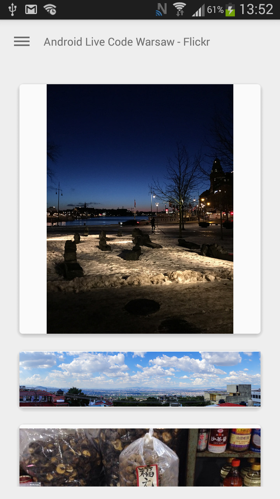

# AndroidLiveCodeWarsawFlickr

Example code showing how easy it is to consume APIs with modern libraries such as Retrofit and OttoCachedField. Written during first edition of Android Live Coding in Warsaw on 14th January 2015

###Highlighted libraries###
Following libraries were used and described during presentation: 
* [Retrofit](http://square.github.io/retrofit/) - type-safe REST client 
* [OttoCachedField](https://github.com/byoutline/OttoCachedField)  - wrapper that caches expensive API calls
* [AndroidStubServer](https://github.com/byoutline/AndroidStubServer) - simple HTTP server that can mock REST server and also return static files
* [Dagger](http://square.github.io/dagger/) - dependency injector

